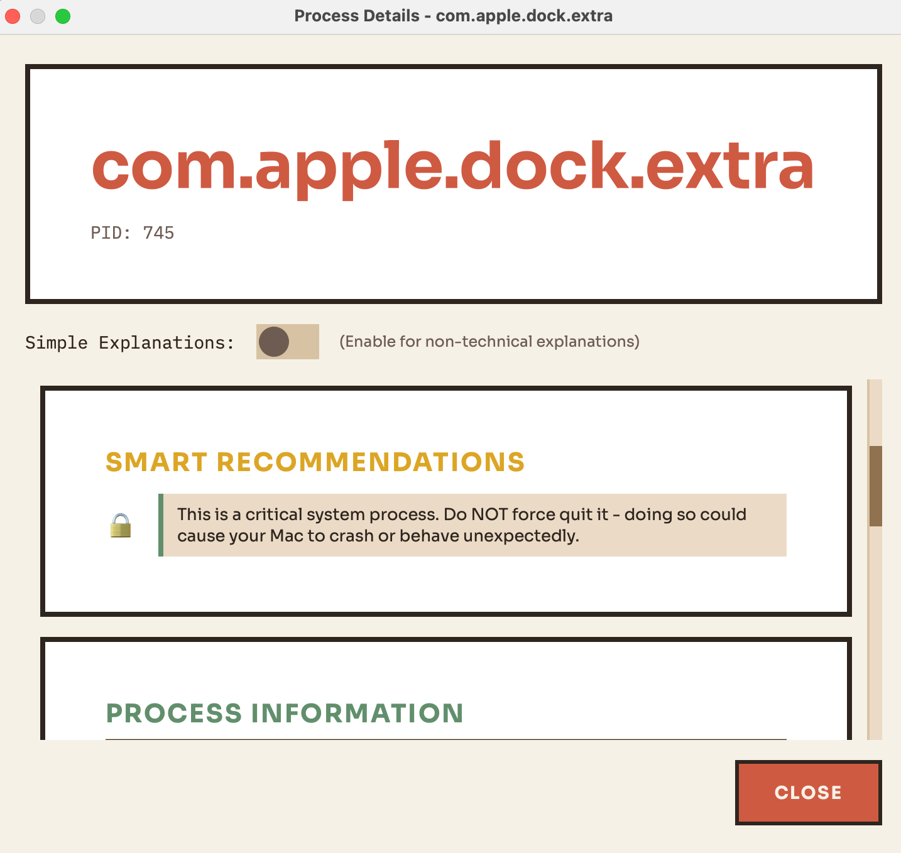

# Mac Health Analyzer

A simple macOS app I built to see what's running on my Mac and manage startup items. Has a cyberpunk-inspired UI because why not.

## Screenshots

### Onboarding


*First-time setup guide explaining what the app does*


*Helpful tips for using the app safely*

### Main Interface

**Startup Tab** - Manage what launches when you boot up


*View all your startup items with stats on enabled/disabled items*

**Processes Tab** - Monitor what's running


*Real-time CPU and memory monitoring for all running processes*

### Detail Views

**Startup Item Details**


*Simple explanations for what each startup item does*


*Smart recommendations based on the item type*

**Process Details**


*Detailed info for recognized processes*



*Safety warnings for critical system processes*

## How to Run

1. Clone or download this repo
2. Install dependencies:
   ```bash
   pip3 install -r requirements.txt
   ```
3. Run the app:
   ```bash
   python3 main.py
   ```

That's it. If you want to see system-level processes, run with `sudo`:
```bash
sudo python3 main.py
```

## Requirements

- macOS 10.14+
- Python 3.9+

## Tests

There's a test suite if you want to run it:
```bash
./run_tests.sh
```

It has pretty good coverage (95%+) and tests most of the functionality.

## Open Source

This is open source - feel free to fork it, modify it, or do whatever you want with it. If you add something cool, open a PR. If you find bugs, open an issue.

## What It Does

- Shows all your startup items (login items, launch agents, launch daemons)
- Lets you disable startup items you don't need
- Monitors running processes with real-time CPU/memory stats
- Shows system health with live charts and gauges
- Has a neon cyberpunk theme because terminals should look cool

## Notes

- Custom fonts download automatically the first time you run it
- Charts update every 2 seconds
- Some operations need admin privileges (that's why there's a `sudo` option)
- Built with PyQt6 and psutil

---

Made this in my free time. Hope it's useful.
